The Assignment report aims to address the questions from [VAST mini challenge.](https://vast-challenge.github.io/2021/MC2.html)

# Overview (Scenario)

The Many of the Abila, Kronos-based employees of GAStech have company cars which are approved for both personal and business use. Those who do not have company cars have the ability to check out company trucks for business use, but these trucks cannot be used for personal business.

Employees with company cars are happy to have these vehicles, because the company cars are generally much higher quality than the cars they would be able to afford otherwise. However, GAStech does not trust their employees. Without the employees? knowledge, GAStech has installed geospatial tracking software in the company vehicles. The vehicles are tracked periodically as long as they are moving.

To promote local businesses, Kronos based companies provide a Kronos Kares benefit card to GASTech employees giving them discounts and rewards in exchange for collecting information about their credit card purchases and preferences as recorded on loyalty cards. This data has been made available to investigators in the hopes that it can help resolve the situation. However, Kronos Kares does not collect personal information beyond purchases.


# Literature Review

The followings are briefly talking about the techniques or resources that I refer to.

1) Use heatmap to show as a calender

The picture below is from report of Central South University in Mini challenge 2014(resources:[http://visualdata.wustl.edu/varepository/VAST%20Challenge%202014/challenges/MC2%20-%20Patterns%20of%20Life%20Analysis/entries/Central%20South%20University/](http://visualdata.wustl.edu/varepository/VAST%20Challenge%202014/challenges/MC2%20-%20Patterns%20of%20Life%20Analysis/entries/Central%20South%20University/). They use heatmap to show the relationship between location and day. 

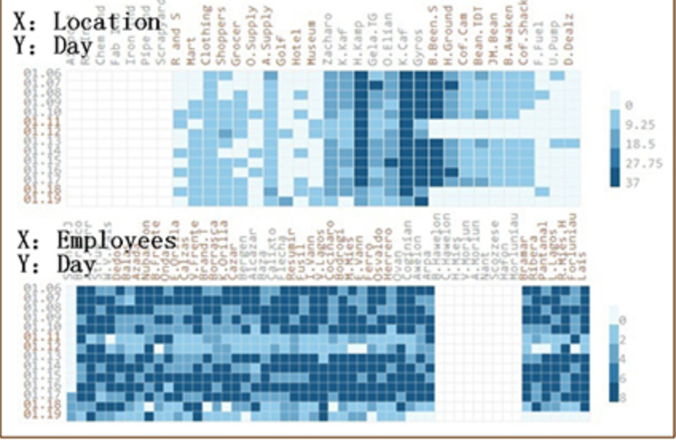

It inspire me to use it as a calender to show the number of people who visit in specific day and time, in this case the x-axis is day and y-axis is hour, and the darkness of the heatmap represents the number of customers.

2) Modify parameters of coordinate

The set up of coordinate is very important for a clear visualization. There are a lot of factors we can change in coordinate including scale of x-axis and y-axis, size of label, font of label, position of label and so on. And R provides us a set of code to modify them. To make the graph clear, I learned it from a page (resource: [https://blog.csdn.net/Bone_ACE/article/details/47427453](https://blog.csdn.net/Bone_ACE/article/details/47427453)), it helps me better understand that which kind of commands can modify which parameters.

# Packages install

```{r setup, include = FALSE}
options(htmltools.dir.version = FALSE)
knitr::opts_chunk$set(fig.retina = 3,
                      echo = TRUE,
                      eval = TRUE,
                      message = FALSE,
                      warning = FALSE)
```

```{r}
packages <- c('raster', 'sf', 
              'tmap', 'clock', 
              'tidyverse','readr','forcats', 'gifski', 'dplyr','plotly', 
              'ggplot2', 'stats', 'graphics','lubridate', 'lobstr', 'igraph', 'patchwork')
for (p in packages){
  if(!require(p, character.only = T)){
    install.packages(p)
  }
  library(p,character.only = T)
} 
```

# Question 1

_Q1: Using just the credit and loyalty card data, identify the most popular locations, and when they are popular. What anomalies do you see? What corrections would you recommend to correct these anomalies?_

First of all, I imported the credit card data and loyalty card data.

```{r}
#import cc_data
cc_data <- read_csv('cc_data.csv')

#import loyalty_data
loyalty_data <- read_csv('loyalty_data.csv')
```

Then I plotted the scatter graph to see visit times of each shops using two data over past 14 days.

```{r}
cc_data %>%
  count(location) %>%
  plot_ly(x = ~ location, y = ~ n, 
          text = ~paste('Shop name:', location, '<br>visit times:', n)) %>%
  add_markers()
```

```{r}
loyalty_data %>%
  count(location) %>%
  plot_ly(x = ~ location, y = ~n) %>%
  add_markers(color = I('red'))
```

From the two graphs above, we can see that there are 4 shops which have much more visit times than other shops.
They are: Katerinais Cafe, Hippokampos, Guy's Gyros and Brew've Been Served. So I just filtered them out to look at the peak time of them.

I just extracted the data related to these top4 stores, then data wrangling is needed including:
sparse time, add day and hour columns, count the visit time of each hour in each store. 

```{r}
# extract top4 shops
visit_times_top4_shops <- cc_data %>%
                        filter(location %in% c("Brew've Been Served",
                                               "Guy's Gyros", 
                                               "Hippokampos", 
                                               "Katerinais Cafe")) 
visit_times_top4_shops$timestamp <- strptime(visit_times_top4_shops$timestamp,"%m/%d/%Y %H:%M")
visit_times_top4_shops_add <- visit_times_top4_shops %>%
                              mutate(day= lubridate::day(timestamp)) %>%
                              mutate(hour=lubridate::hour(timestamp))
visit_times_top4_shops_add_count <- visit_times_top4_shops_add %>%
                                    group_by(location, day,hour) %>%
                                    summarise(n=n()) %>%
                                    arrange(day, hour)
```

Then I used raster graph to plot the visit times, the raster graph is easy for comparison of hour as well as stores.

```{r}
#raster of top4 shops
ggplot(visit_times_top4_shops_add_count, aes(x = day, y = hour,fill = n)) +
  geom_tile() +
  scale_fill_continuous(high ="#132B43", low ="#56B1F7") +
  facet_grid(location~.) +
  scale_x_continuous(limits=c(1,20), breaks=seq(1,20,1))+
  scale_y_continuous(limits = c(1,24), breaks = seq(1,24,1))+
  labs(x= 'Day of the month', y = 'Hour of the day') 
```

From the graph above, I can see that 

 1) Peak time of Brew've Been Served is from 7am to 8am, it is more like a breakfast store, plus it may close on weekend. And the degree of popularity is more than other three stores.
 
 2) Guy's Gyros has customers either in the noon or in the evening, but the most popular time in the whole day would be 20pm.
 
 3) Hippokampos is similar as Guy's Gyros, which open either in the noon and in the evening, bu the most popular time is 13pm.
 
 4) In comparison to Guy's Gyros and Hippokampos, Katerinais Cafe is more popular, the popular time includes 13pm and 20pm.
 
 There are several anomalies I found during the exploration.
 
 __1.loyalty card used times are less than credit used times in these four popular shops__
 
 The number of loyalty card used time and number of credit card used time in most of shops are equal, at most 1 or 2 difference between them, whereas  the difference in these 4 popular shops are much more than that, has more than 10 difference.
 
 
 I assume that this anomaly comes up probably because people like to invite friends to eat together, so after finishing the meal, check-out only needs one loyalty card. In other word, these four places are popular for parties.
 
 __2. Some stores in the credit data cannot be found in the map.__
 
 From the picture above I realized that several stores which appeared in the credit data or loyalty data cannot be found out in the MC2-Tourist map. The stores include Abila Zahharo, Golf course, Ouctarian Office supplier, Shopper's Delight, Stewart and Sons Fabrication, Kalami Kafenion and Hippokamas.
 
By observation of these stores, I found out that these stores can be categorized into 2 types, one is grocery type, the other one is manufacture type. In this case, I assume that these stores may be located in 2 malls or marts or markets.

 __3. Variance of purchase in Hippokampos is biggest.__
 
Since the data includes the value of purchase each time, so I just dived in depth to see the price distribution of four popular stores.
 
```{r}
ggplot(visit_times_top4_shops, aes(x = location, y = price)) +
  geom_boxplot(outlier.colour = 'red')
```

From the graph we can see that the median price of Guy's Gyros, Hippokampos and Katerinais Cafe look similar and are much higher than Brew've Been Served. Variance of price from Hippokampos is higher than other popular stores and the maximum price from Hoppokampos is larger than other places.

I assume that 2 reasons may cause it. Firstly, people like to eat together in Hippokampos, so the total value of each purchase is high, another reason is that the dishes in Hippokampos might be a bit expensive.

In summary, if owners of stores want to earn more money, they should place some tables which can accommodate a lot of people to eact together.

 __4. There are some cross-use of credit card and loyalty card__

For further analysis, I combined the credit card data and loyalty card data based on same price, time, and location

```{r}
#modify the format of data
cc_data$timestamp <- as.Date(cc_data$timestamp, '%m/%d/%Y')
loyalty_data$timestamp <- as.Date(loyalty_data$timestamp, '%m/%d/%Y')
# combine 2 data
data_combined <- inner_join(cc_data, loyalty_data, 
                            by = c("timestamp" = "timestamp", "location" = "location", "price" = "price"))
```

Since bipartite data should include only 2 columns to correspond to each side, so I only contain the last4num and loyaltynum column.
Plus, it is impossible that people purchase one time or use the card one time, so there must have a lot of duplicate rows, in this case I used '!duplicate' function below, to remove redundancy.

```{r}
# keep last4ccnum and loyaltynum
data_combined_filter <- data_combined[4:5] 
data_combined_filter <- data_combined_filter[!duplicated(data_combined_filter),] %>% 
  arrange(last4ccnum, loyaltynum)
```

The code chunk below is the process of plotting a bipartite graph, since plot function need the input table to be a vector, so I convert it to a vector first and specify the area of each side using 'type' shown below.

```{r}
# plot bipartite graph
data_combined_filter <- graph_from_data_frame(data_combined_filter, directed = FALSE) 
V(data_combined_filter)$type <- bipartite_mapping(data_combined_filter)$type
col <- c("steelblue", "orange")
shape <- c("circle", "square")
plot(data_combined_filter,layout = layout.bipartite,
     vertex.color = col[as.numeric(V(data_combined_filter)$type)+1],
     vertex.shape = shape[as.numeric(V(data_combined_filter)$type)+1])
```

Plus, to support my visualization of biartite graph, I also created a data table to help me better understand.

```{r}
DT::datatable(data_combined, filter = 'top')
```

From the bipartite graph above we can see that there are several credit card sharing the same loyalty card. With the help of data table, I find out all the sharing pattern.

```{r}
data_combined_filter <- data_combined[4:5] 
data_combined_filter <- data_combined_filter[!duplicated(data_combined_filter),] %>% 
  arrange(last4ccnum, loyaltynum)
data_combined_filter_final <- data_combined_filter %>%
  filter(last4ccnum == '4795' | last4ccnum == '8332')
data_combined_filter_final <- graph_from_data_frame(data_combined_filter_final, directed = FALSE)
V(data_combined_filter_final)$type <- bipartite_mapping(data_combined_filter_final)$type
col <- c("steelblue", "orange")
shape <- c("circle", "square")
plot(data_combined_filter_final,layout = layout.bipartite,
     vertex.color = col[as.numeric(V(data_combined_filter_final)$type)+1],
     vertex.shape = shape[as.numeric(V(data_combined_filter_final)$type)+1])
```


For example, like the graph above,I used a filter to extract credit card 4795 and 8332 , and owner of 2 cards share 2 loyalty cards (L2070 and L8566).

I assume that the graph happens probably because that the owners of these cards have an important relationship such as couple, relatives, colleagues and so on.
 
 
# Question 2 and Question 3

_Q2: Add the vehicle data to your analysis of the credit and loyalty card data. How does your assessment of the anomalies in question 1 change based on this new data? What discrepancies between vehicle, credit, and loyalty card data do you find?_

_Q3:Can you infer the owners of each credit card and loyalty card? What is your evidence? Where are there uncertainties in your method? Where are there uncertainties in the data?_

Based on the gps data and credit data/loyalty data, I think I can solve the anomaly issue 2 in question 1.
And the anomaly issue 3 in question 1 also can be solved based on analysis of each individual car gps data.
First of all,plot the layer of map.

```{r}
bgmap <- raster("MC2-tourist.tif")

tmap_mode("plot")
tm_shape(bgmap) +
  tm_rgb(bgmap, r = 1,g = 2,b = 3,
         alpha = NA,
         saturation = 1,
         interpolate = TRUE,
         max.value = 255)

Abila_st <- st_read(dsn = "Geospatial",
                    layer = "Abila")
```

Then do some modification of imported data including transfer of the data type, grouping the data and so on.

```{r}
gps <- read_csv("gps.csv")
glimpse(gps)
gps$Timestamp <- date_time_parse(gps$Timestamp,
                                 zone = "",
                                 format = "%m/%d/%Y %H:%M:%S")
gps$id <- as_factor(gps$id)
gps_sf <- st_as_sf(gps, 
                   coords = c("long", "lat"),
                   crs= 4326)

gps_path <- gps_sf %>%
  group_by(id) %>%
  summarize(m = mean(Timestamp), 
            do_union=FALSE) %>%
  st_cast("LINESTRING")
```

Plot the path of ID 3 as an example.

```{r}
gps_path_selected <- gps_path %>%
  filter(id == 3) 

tmap_mode("view")
tm_shape(bgmap) +
  tm_rgb(bgmap, r = 1,g = 2,b = 3,
         alpha = NA,
         saturation = 1,
         interpolate = TRUE,
         max.value = 255) +
  tm_shape(gps_path_selected) +
  tm_lines()
```

The graph above, as an example, shows the id3 path over the whole past 14 days.

In addition, I can also get the path of particular car in particular day and particular hour. It can be achieved by the code chunk below.
First of all, I created 2 new columns to extract the day and hour from timestamp.

```{r}
gps_sf_date <- gps_sf %>% 
  mutate(day = get_day(Timestamp),
         hour = get_hour(Timestamp))
```

Then, if I want to get the path of particular car in the whole day, I need to group by id and day then plot it.

```{r}
gps_path_date <- gps_sf_date %>%
  group_by(id, day) %>%
  summarise(n = n(),
            do_union = FALSE)%>%
  st_cast("LINESTRING")

gps_path_selected_date <- gps_path_date %>%
  filter(id == 17, day == 9) 
tmap_mode("view")
tm_shape(bgmap) +
  tm_rgb(bgmap, r = 1,g = 2,b = 3,
         alpha = NA,
         saturation = 1,
         interpolate = TRUE,
         max.value = 255) +
  tm_shape(gps_path_selected_date) +
  tm_lines()
```

The graph above, as an example, shows the driving path of car 15 in 9th of January.
Specifically, if I want to know the more detailed path in each hour, I just need to add hour into group by then plot it.

```{r}
gps_path_hour <- gps_sf_date %>%
  group_by(id, day, hour) %>%
  summarise(n = n(),
            do_union = FALSE)%>%
  st_cast("LINESTRING")

gps_path_selected_hour <- gps_path_hour %>%
  filter(id == 24, day == 9, hour == 3) 
tmap_mode("view")
tm_shape(bgmap) +
  tm_rgb(bgmap, r = 1,g = 2,b = 3,
         alpha = NA,
         saturation = 1,
         interpolate = TRUE,
         max.value = 255) +
  tm_shape(gps_path_selected_hour) +
  tm_lines()
```

At next step, I also tried to extract the places that each credit card purchase over past 14 days, based on the purchase records and path tracking,
Combining the path and purchase record, it is highly possible that I can find out the missing place and even find out the car corresponding to the credit card.

Similarly, the first step should be data wrangling, in this case, I convert timestamp as date type, then count the number of distinct credit card.

```{r}
cc_data$timestamp <- as.Date(cc_data$timestamp, '%m/%d/%Y')
cc_data$last4ccnum <- as.character(cc_data$last4ccnum)
cc_data_count <- cc_data %>%
  summarize(total_cc_card = n_distinct(last4ccnum))
```

Then I just group by the data using date and location to record where this person purchase and how many times she/he visits in a day.

```{r}
cc_data_timestamp <- cc_data %>%
  filter(last4ccnum == '1286') %>%
  group_by(timestamp, location) %>%
  summarise(n = n())
ggplot(cc_data_timestamp, aes(timestamp, n, fill = location)) +
  geom_col() +
  geom_text(aes(label = location),position = position_stack(vjust = 0.3),color='black',size = 2,angle = 90) +
  ggtitle('last4ccnum: 1286')+
  scale_x_date(date_minor_breaks = "1 day",date_labels = "%m/%d") +
  scale_y_continuous(breaks = seq(0,5,1)) +
  theme( legend.text = element_text(size = 5),
        plot.title = element_text(colour = "black", face = "bold", size = 10, hjust = 0.5))
```

The graph above, as an example, plot the purchase records of '1286' credit cards over past 14 days.
By comparing the bar chart and the path of the car, I can match the credit card and car ID respectively. And the result is shown as the table below:

car ID       | Credit card
------------|--------------
id 1        | 9551     
id 2        | 1415
id 3        | 
id 4        | 7688
id 5        | 6899
id 6        | 7253
id 7        | 2540
id 8        | 7889
id 9        | 
id 10       | 8332
id 11       | 1321
id 12       | 7108
id 13       | 7819
id 14       | 1874
id 15       | 3853
id 16       | 7354
id 17       | 7384
id 18       | 9617
id 19       | 6895
id 20       | 6816
id 21       | 9405
id 22       | 1286
id 23       | 3484
id 24       | 4434
id 25       | 2142
id 26       | 1310
id 27       | 3495
id 28       | 9241
id 29       | 5921
id 30       | 6901
id 31       | 5010
id 32       | 
id 33       | 9683
id 34       | 4795
id 35       | 2463

Since I inferred the correspondence between credit card and car ID, I would be able to locate the stores which can not be found previously in the map in question 1.

For example, credit card 2540 matches ID 7, from the bar chart 2540 I found that this guy went to Abila Zacharo on 18th of January.
In this case, I just tracked the gps of ID 7 on 18th of January and I will find out the location. 

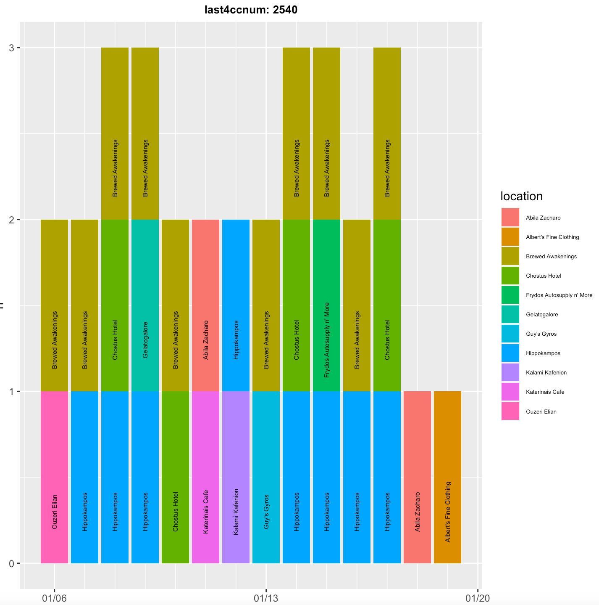
 Using this method, I found out that Abila Azacharo is located in 'Robert and son' or near it.
 
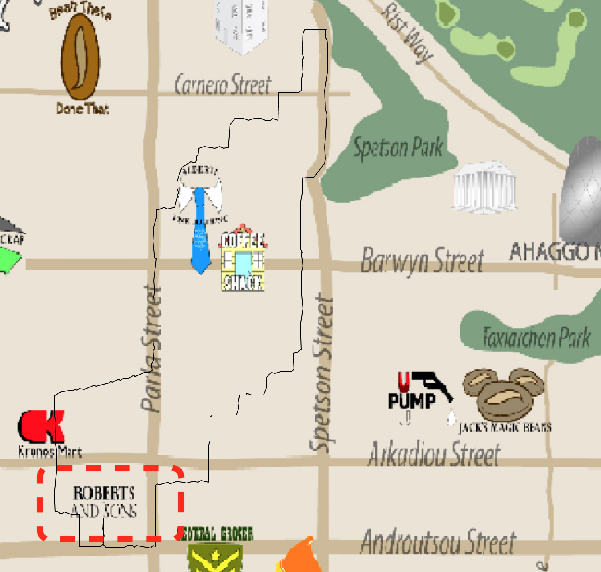

With the method, I find all the stores location and it is shown as below.

* Shopper's Delight: On the left of Ouzeri Elian.
* Kalami Kafenion: In Korono Mart or near it.
* Stewart and Sons Fibrication: In General Grocer or near it.
* Octavio's Office Supplier: In General Grocer or near it.
* Hippokampos: Near Fine clothing.
* Desafio Golf Course: Near Porlo Park.
* Brew Awakening: In Jack Magic Bean or near it.

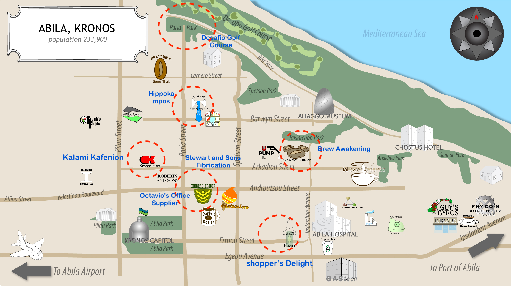

## Uncertainty
 
However, there are some uncertainties when I analyze the graph by comparing the graphs.
 
 > Information from gps and credit card might be inconsistent
 
 Due to the path tracking only navigate where people stop, some people may stop near a store, but they just walk around rather than buying some stuffs. Plus, some area has multiple store nearby, in this case, it is highly likely that some people park the car near 'store A' but buy products in 'store B', or they buy things from several store in a row when they park at one place.
 
 > The driving path has no obvious unique pattern
 
 Since the stores are limited, and all people are employees of GASTech, meaning that most of them have similar life routine. Meanwhile, it also means that the path of several cars are very similar, in this case it is quite hard to match a credit card to a car ID from many similar driving driving paths. That is a part of reason why I can not find out several matching in the table above.
 
From my understanding,this issue can be addressed when the gps data is large enough or when we can get some other information to support analysis.

# Question 4

_Q4: Given the data sources provided, identify potential informal or unofficial relationships among GASTech personnel. Provide evidence for these relationships?_

Based on the bipartite graph I built in question 1, I found out some unusual pattern between credit card and loyalty card.
The pattern is consider as an unusual pattern because of an assumption I made:

__Each employee can only apply for one loyalty card from company whereas each person can own more than one credit card from different bank.__

In this case, some patterns shown as below would be abnormal.


The pattern above can happen probably because owner of 1286 borrowed loyalty card from owner of 9241. In other word, they are familiar with each other. By checking the matching table in previous question, 9421 is corresponding to car ID 28 and 1286 is corresponding to car ID 22.

Similarly, by observing the pattern below and using the same method, I can also get that: owner of car ID 10 and car ID 34 know each other.

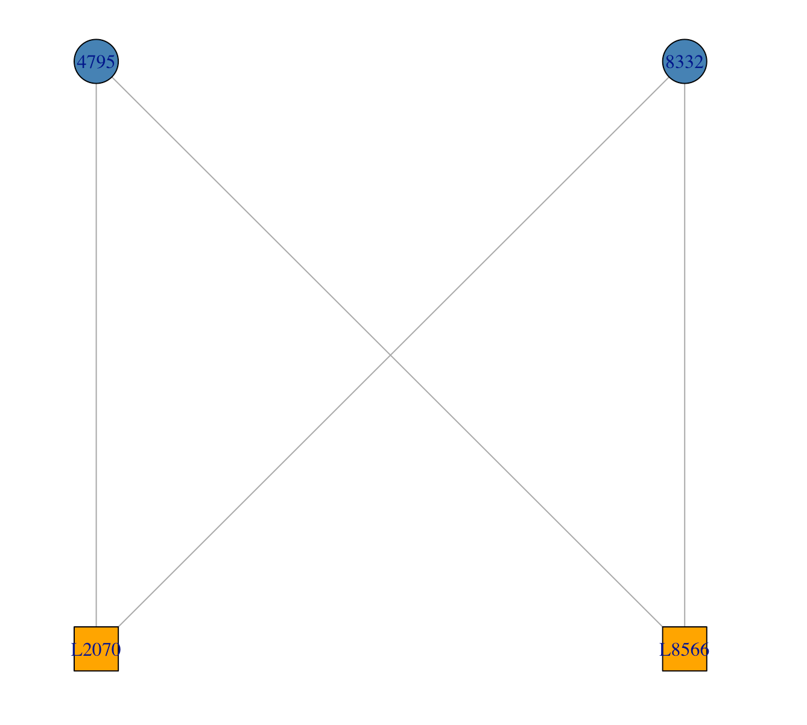

Apart from looking at the bipartite graph, I can also get some valuable information from driving path. I used 'tmap' package to create gif of each car path, it would be clear to get the basic routine and find out the place where each employee lives.

```{r}
# created animation
m <- tm_shape(bgmap) +
  tm_rgb(bgmap, r = 1,g = 2,b = 3,
         alpha = NA,
         saturation = 1,
         interpolate = TRUE,
         max.value = 255) +
  tm_shape(gps_path) +
  tm_lines() +
  tm_facets(along = "id")
```

```{r}
tmap_animation(m, 
               filename = "drivers.gif",
               delay=40)
```


By observing the path of each car, I noticed that there are several major communities where employees live. 

1) The white house on the top of map.

Owners of car 2, 3, 7, 9, 11, 19 live there.(gif below is from car 09 as an example)
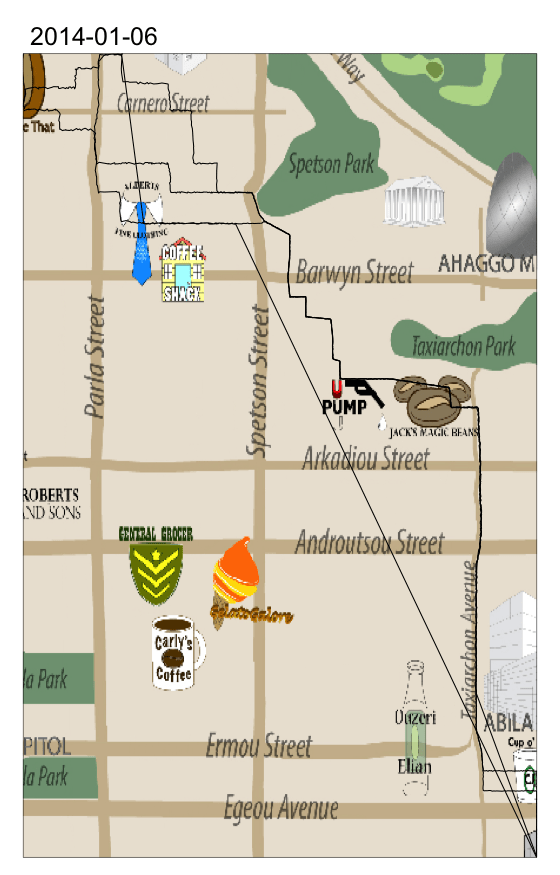


2) The area on the left of Guy's Gyros.

Owners of car 6, 14, 17, 18, 22, 23, 24, 25, 29, 30, 33 live there.(gif below is from car 06 as an example)
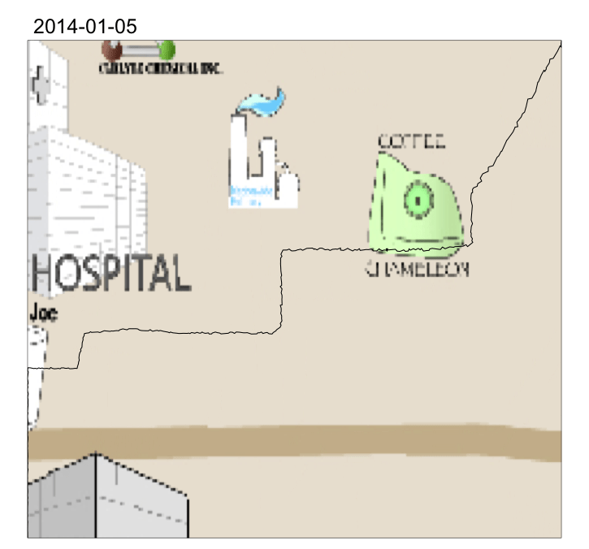

3) The area around Hallow Ground.

Owners of car 1, 8, 12, 27 live there.(gif below is from car 12 as an example)
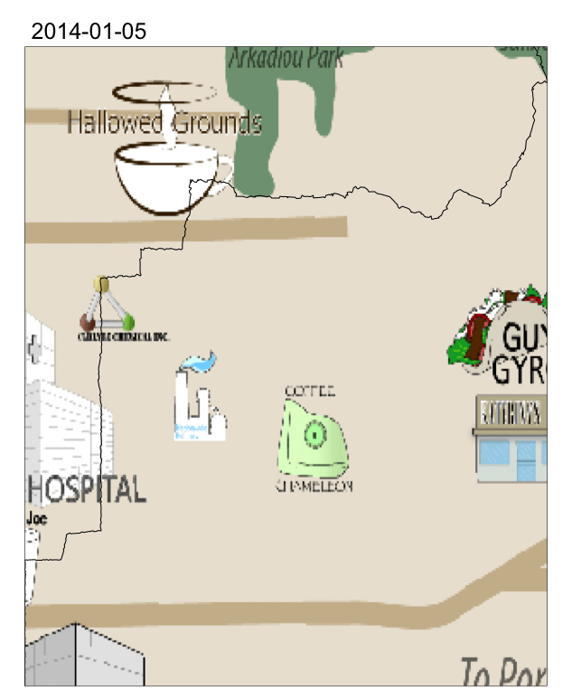

Apart from community location, I also find out some other relationships by tracking the path.
The first relationship I noticed is that **car ID 14 and car ID 18 are possibly living together**, since they live in the same area and have similar driving routine.

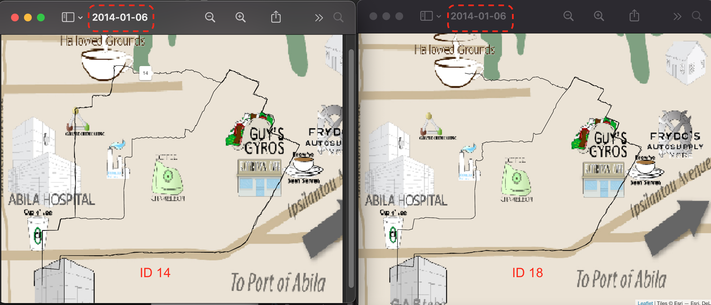

The other relationship I noticed is that __car ID 4, car ID 10, car ID 35 are friends.__
First reason is that where each of them lives are very close, plus on each Sunday (12th and 19th of January), they all went to the golf course at the similar point of time.

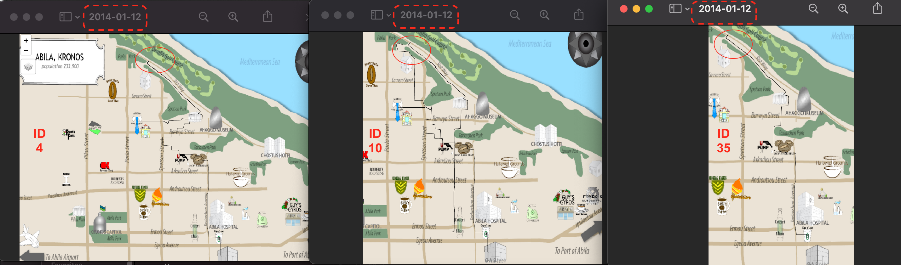

Since I can match each car to particular employee by checking 'car assignment' file, I summarize the conclusions above:

* Nubarron Adra (Badging Office) and Orilla Kare (Drill Technician) know each other.
* Campo-Corrente Ada (SVP/CIO) and Tempestad Brand (Drill Technician) know each other.   
* Dedos Lidels (Engineering Group Manger) and Frente Birgitta might live together.
* Barranco Ingrid (SVP/CFO) and Campo-Corrente Ada (SVP/CIO) and Vasco-Pais Willem (Environmental Safety Advisor) are friends.

# Question 5

_Q5: Do you see evidence of suspicious activity? Identify 1- 10 locations where you believe the suspicious activity is occurring, and why?_

> Guy's Gyro is one suspicious place to hold activities.

During the exploration of question 1, I plotted line chart of 4 popular stores to show the number of visit over time. The code chunk just demonstrates how I plot it.

```{r}
credit_data <- read_csv('cc_data.csv')
#extract top4 shops from cc_data
four_top_shops <- credit_data %>%
                   filter(location %in% c("Brew've Been Served", "Guy's Gyros", "Hippokampos", "Katerinais Cafe")) %>%
                  group_by(location,timestamp) %>%
                  summarise(n = n())
#plot time series of top4 shops
ggplot(four_top_shops, aes(x= factor(timestamp), y = n, group = 1)) +
  geom_line() +
  facet_grid(location~.) +
  xlab('timestamp')
```

From the graph above, I noticed that at the end of last day(19th of January), there is a significant increase in number of visitors.
And it is very different from its normal pattern. Plus, it is just one night before the accident. So the people who visited Guy's Gyro is highly likely to be the criminal suspects.

> Brew've Been Served is a suspicious place

If I continue previous inference, I was thinking that if those people who like to visit Hippokamas also like to go to one place in the same day, then can I assume that this place might also be a suspicious place? Along the line of assumption, I join the credit data with itself based on same day, same card number, but different location, then see the relationship of 2 locations.

```{r}
credit_data <- credit_data %>%
  mutate(date = as.Date(timestamp))
data_combined_2 <- inner_join(credit_data, credit_data,
                              by = c('last4ccnum' = 'last4ccnum', 
                                     "date" = "date")) %>%
  filter(!location.x == location.y) %>%
  group_by(location.x, location.y) %>%
  summarise(n = n())
  
ggplot(data_combined_2, aes(location.x, location.y)) +
  geom_point(aes(size = n)) +
  xlab('location 1') +
  ylab('location 2') +
  theme(axis.text.x = element_text(size = 5, vjust = 0.5, hjust = 0.5, angle = 90),
        axis.text.y = element_text(size = 5, vjust = 0.5, hjust = 0.5))
```

Based on the size of circle in the graph above we can see that Brew've Been Served and Hippomakas are 2 places where people like to go in the same day.

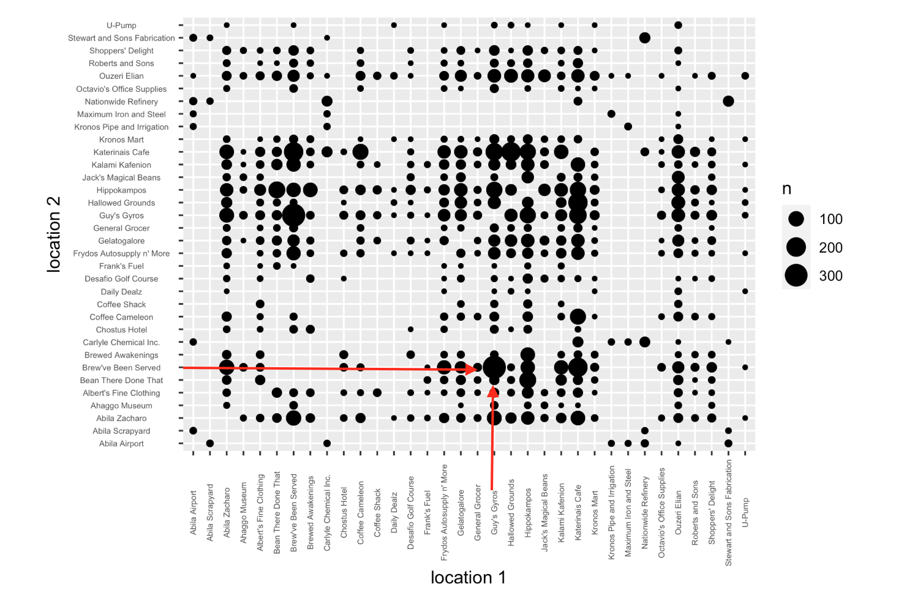

> The white house on the top of map is a suspicious place

When I analyzed the gps data, I found out that on 10th of January, there are a lot of people heading to the white house(in Canero street). However they do not live there and the activity was held until 23pm. 

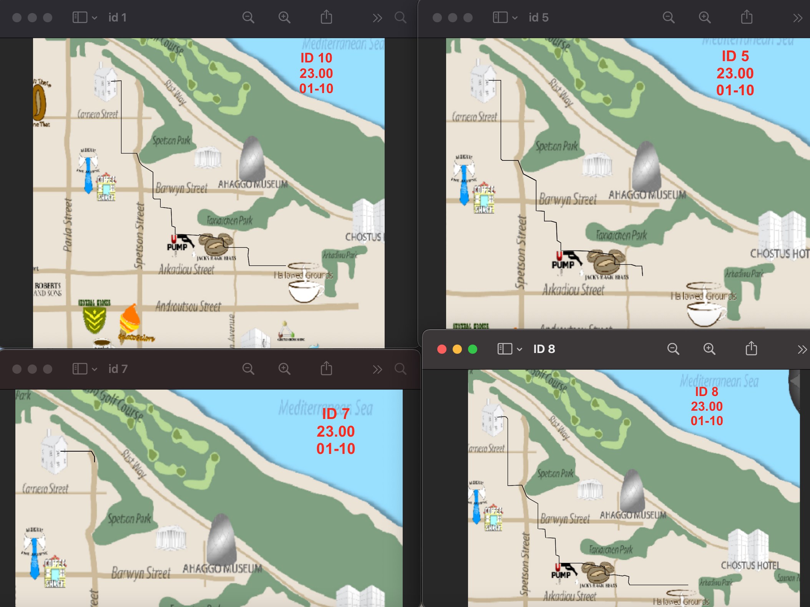
The reason that I feel it is abnormal is because people who went there on 10th do not go to party or meet people at late night based on the routine of other days. Plus, they all went back home at about23pm, so there must have a getting-together.

> The White house next to museum is a suspicious place

I used the heatmap graph to plot active period of all cars, by comparing vertically and horizontally, I can find out some abnormal period of time.

```{r}
gps_new <- gps %>%
  mutate(day = get_day(gps$Timestamp), hour = get_hour(gps$Timestamp)) %>%
  tidyr::unite("day_hour", day, hour)
gps_new$day_hour <- as_factor(gps_new$day_hour)
gps_new_time <- gps_new %>%
  group_by(id, day_hour) %>%
  summarise(n = n())

ggplot(gps_new_time, aes(x = day_hour, y = id, fill = n)) +
  geom_tile()+
  scale_fill_continuous(high ="#132B43", low ="#56B1F7") +
  theme(axis.text.x = element_text(size = 5, vjust = 0.5, hjust = 0.5, angle = 90),
        axis.text.y = element_text(size = 5, vjust = 0.5, hjust = 0.5))
```

From the graph below we can see that there are several car active period happening at midnight, comparing to the daily schedule of them, it must be abnormal. Plus, comparing to other cars, if some of cars happen to be active at the same time, we might know other suspects.
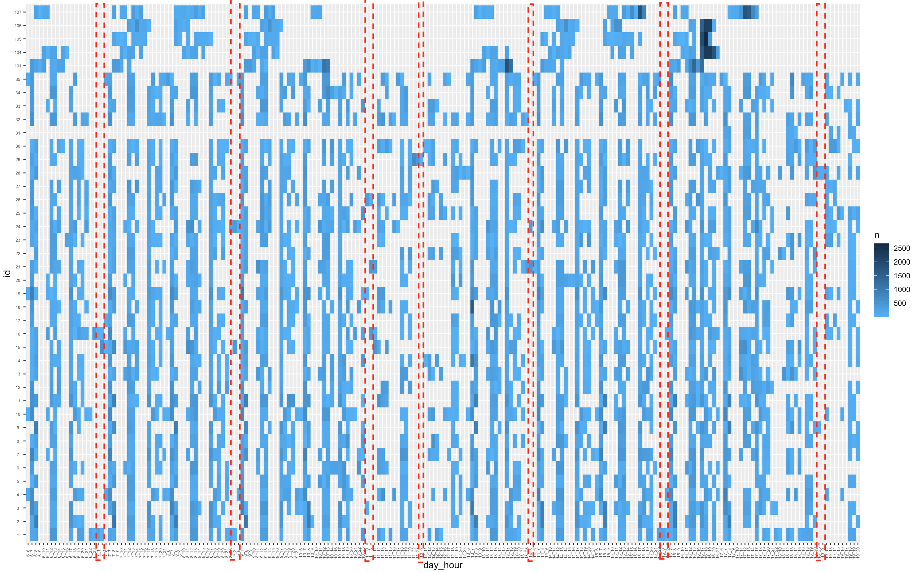
Along the assumptions I made, I find out that the owners of car 16 and car 21 live in the same community, next to the Fyrdo's auto supply. At night of 10th of July, they both went to the white house next to the museum and return home until 3 am.

```{r}
g16 <- gps_path_hour %>%
  filter(id == 16, day == 11, hour == 3) 
tmap_mode("view")
tm_shape(bgmap) +
  tm_rgb(bgmap, r = 1,g = 2,b = 3,
         alpha = NA,
         saturation = 1,
         interpolate = TRUE,
         max.value = 255) +
  tm_shape(gps_path_selected_hour) +
  tm_lines()

g21 <- gps_path_hour %>%
  filter(id == 21, day == 11, hour == 3) 
tmap_mode("view")
tm_shape(bgmap) +
  tm_rgb(bgmap, r = 1,g = 2,b = 3,
         alpha = NA,
         saturation = 1,
         interpolate = TRUE,
         max.value = 255) +
  tm_shape(gps_path_selected_hour) +
  tm_lines()

```

Plus, car id 24 also visited this place in 2 other days, but the time point is same, at around 3am.

```{r}
g24 <- gps_path_hour %>%
  filter(id == 24, day == 9, hour == 3) 
tmap_mode("view")
tm_shape(bgmap) +
  tm_rgb(bgmap, r = 1,g = 2,b = 3,
         alpha = NA,
         saturation = 1,
         interpolate = TRUE,
         max.value = 255) +
  tm_shape(gps_path_selected_hour) +
  tm_lines()

```
# Summarization

In Summary, using the gps data and credit card record can help us to detect some abnormal pattern, and it is useful for us to locate the possible places where suspects used to discussed and hide after crime. However, to specify who are suspects, we still need combine other data.

In addition to the analysis above, if time is allowed, I think I can also use correlation function to get the potential relationship between the stores or the people in the future.